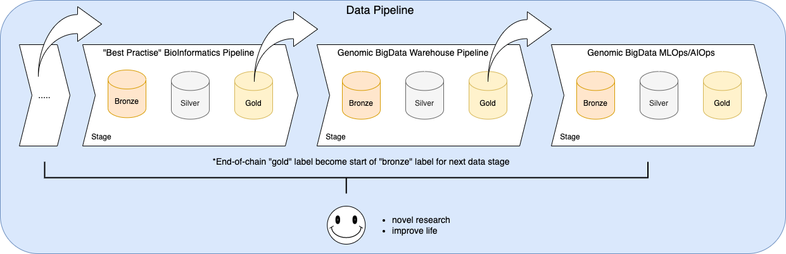

# Genomic BigData Spark

Placeholder Title: _Genomic BigData Warehousing with Apache Spark and LakeHouse Architecture_

The following is excerpt. If you would like to read as Paper or Article like format, please see [99_writing.ipynb](99_writing.ipynb) for the draft.


## Abstract

In this repo/article, we explore and discuss Cloud-native BigData engineering approach for handling Genomics data warehousing. The technique underpin BigData processing and data warehousing with Apache Spark and Data [Lakehouse](https://www.databricks.com/blog/2020/01/30/what-is-a-data-lakehouse.html) architecture on Genomics data of "gold" label VCF files. We set up Genomic Table along with Metadata Table in Cloud-native fashion to bring both Genotype and Phenotype together within single or federated queryable interface. By levering Cloud-native setup, we bring Data & Compute closer together to avoid unnecessary data staging for further Genomic analysis or Cohort data building process.

Genomic Table and, as such sourcing data warehouse directly from VCF could easily get out of hand. Typically, a "best practice" BioInformatics Pipeline should have finer, distilled, end-of-chain, "gold" label VCF product. This VCF file or metrics/fact files should contain a handful of records per patient that have already analysed & annotated well for a given use case. If sourcing Genomic Table from VCF is not appropriate then one could leverage more summarised tables output from MultiQC or some Cancer Reporter as see fit.

Hence, this kind of Genomic BigData warehouse would still rely on high quality output of BioInformatics Pipeline and, continuation of overall Data Pipeline as depict in figure below.




## Steps

In the following, we attempt to set up local development environment to study how to use Spark, Glow to explore some "gold" label VCF output from some "best practice" BioInfo Pipelines. Then, we make some data transformation and write final dataframe as Deltatable format.

We will use JupyterLab as our development editor and, execute each notebook cell block to observe the output interactively.

### Toolchain

As prior exercise, it is recommended to try the following repos to understand basic of Spark and LakeHouse tables.

* https://github.com/victorskl/deltalake-tute
* https://github.com/victorskl/iceberg-tute
* https://github.com/victorskl/hudi-tute

First, we need to have local development toolchain ready. It is recommended have it installed the following JDK version:

- JDK 11
- Apache Maven 3.8

If you are on macOS, this can be like:

```
brew install maven openjdk@11
```

The following are versions print out as guideline:
```
java -version
  java version "11.0.12" 2021-07-20 LTS

mvn --version
  Apache Maven 3.8.6 (84538c9988a25aec085021c365c560670ad80f63)
```

Next, create our main conda environment:
```
conda create -n genomic-bigdata-spark python=3.10
conda activate genomic-bigdata-spark
```

Pull our main dependencies:
```
pip install -r requirements.txt
```

Pull additional Java packages:
```
mvn dependency:tree
```

```
[INFO] Scanning for projects...
[INFO]
[INFO] ---------------< com.sankholin.genomic.bigdata:SparkApp >---------------
[INFO] Building SparkApp 0.0.1
[INFO] --------------------------------[ jar ]---------------------------------
[INFO]
[INFO] --- maven-dependency-plugin:2.8:tree (default-cli) @ SparkApp ---
[INFO] com.sankholin.genomic.bigdata:SparkApp:jar:0.0.1
[INFO] +- net.sf.jopt-simple:jopt-simple:jar:5.0.3:compile
[INFO] \- org.xerial.snappy:snappy-java:jar:1.1.8.2:compile
[INFO] ------------------------------------------------------------------------
[INFO] BUILD SUCCESS
[INFO] ------------------------------------------------------------------------
```

### Data

First, we need to download data from bcBio somatic-like tumor-normal Pipeline using Somatic truth sets from Genome in a Bottle (GiAB) samples output at [8]

```
wget https://s3.amazonaws.com/bcbio/giab/NA12878-NA24385/2018-07-05/na12878-na24385-somatic-hg38-truth.vcf.gz
wget https://s3.amazonaws.com/bcbio/giab/NA12878-NA24385/2018-07-05/na12878-na24385-germline-hg38-truth.vcf.gz
```

Next, we create VCF stats file using `bcftools` as follows.

```
bcftools stats na12878-na24385-somatic-hg38-truth.vcf.gz > na12878-na24385-somatic-hg38-truth.stats.txt
bcftools stats na12878-na24385-germline-hg38-truth.vcf.gz > na12878-na24385-germline-hg38-truth.stats.txt
```

Next, we create `metadata.csv` that mock minimal meta information about individual details, some clinical and Phenotypic data mock up. To simplify thing, we arrange it in flat normalised table structure.

### JupyterLab

Launch Jupyter server by entering from terminal:

```
jupyter-lab
```

From JupyterLab interface, we open each notebook one by one in order. Execute each cell to make our observation.

```
01_glow_vcf_explore_somatic.ipynb
02_glow_vcf_explore_germline.ipynb
03_glow_vcf_explore_merged.ipynb
04_glow_vcf_deltatable_somatic.ipynb
05_glow_vcf_deltatable_germline.ipynb
06_metadata_deltatable.ipynb
07_querying_lakehouse.ipynb
```


## Future Work

This has yet to evaluate further on real world data workload (case by case basis) and, setting up some decent size cohort-wide data warehousing. Performance and feasibility study benchmarking on various technologies that underpin the setup. There is also to explore data partitioning within Deltatable or chosen LakeHouse table framework.

We could also explore a more specialised Cloud-native BioInfo formats: `BioParquet` _ala_ [GeoParquet](https://github.com/opengeospatial/geoparquet)? We can also compare with other LakeHouse table framework: Iceberg, Hudi -- of which may or may not work better than Deltatable. Similarly, this entails more specific to Genomic such that `BioTable` or `GenomicTable` LakeHouse table specification effort?
